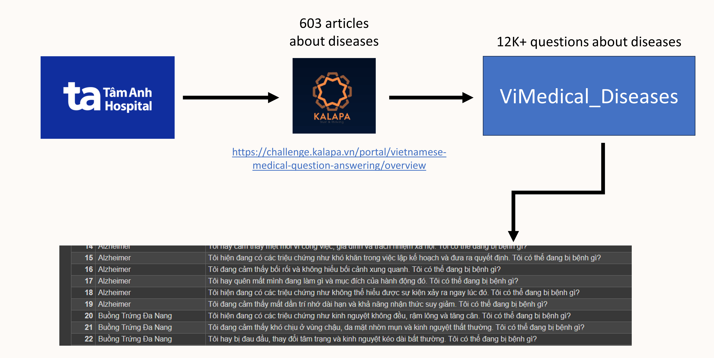

 <h1 > 🗃 ViMedical Disease</h1>

  

 Creation date: 2024-04-05  Authors: Phuc Nguyen, Dao Thong 

[**Vietnamese cap: here**](https://github.com/PB3002/ViMedical_Disease/tree/main/README_Vietnamese.md)

## Overview:

ViMedical Disease is a dataset that encompasses a collection of over 12K+ questions and symptoms for common diseases. This dataset is designed to aid in the classification of disease symptoms and the preliminary identification of medical conditions. It contains information about numerous prevalent diseases, including cardiovascular, gastrointestinal, neurological, dermatological, endocrine, and other conditions. This dataset can be used for research purposes, developing predictive models for diseases, or providing users with information on common disease symptoms.

The dataset is now available on other platforms, including:

-   [**<u>Kaggle</u>**](https://www.kaggle.com/datasets/pb30025030/vimedical-disease/data)

-  [**<u>Huggingface</u>**](https://huggingface.co/datasets/PB3002/ViMedical_Disease)

## ⚠️Disclaimer:

- This dataset provides information about disease symptoms only; it is not a formal medical diagnosis.

- Users should consult with a healthcare professional for an accurate diagnosis and treatment.

## Data construction process:

The ViMedical_Diseases dataset is based on a pre-existing dataset from the Kalapa Bytebattles 2023 competition in the Vietnamese Medical Question Answering section.

The dataset provides over 600 articles on various diseases, collected from Tam Anh Hospital.

From the available dataset, 603 different diseases were extracted, and 20 questions were generated about patients experiencing symptoms of those diseases.

## Structure:

Each question will be structured as follows: "I'm having symptoms like/I'm feeling/I often/..." + description of the disease's symptoms from the article + ". What could be wrong with me?"

Each question will begin with phrases like "I/I'm having symptoms like/I'm feeling/I often/...".

Following these phrases will be symptoms of the disease taken from the article.

And the question will always end with the question "What could be wrong with me?".

The dataset has 2 columns:

- `Disease`: Disease name

- `Question`: Question and description of disease symptoms

## Example data:

| Disease             | Question                                                                                    |
|:------------------- |:------------------------------------------------------------------------------------------- |
| Bệnh Cơ Tim Giãn Nở | Tôi đang cảm thấy mệt mỏi, chóng mặt và nhịp tim không đều. Tôi có thể đang bị bệnh gì?     |
| Alzheimer           | Tôi hay quên mất mình đang làm gì và mục đích của hành động đó. Tôi có thể đang bị bệnh gì? |
| Viêm Cầu Thận Lupus | Tôi đang cảm thấy suy giảm chức năng thận, hội chứng thận hư. Tôi có thể đang bị bệnh gì?   |

## Dataset Usage:

-    Data Analysis
-    Building a Disease Prediction Model
-    Creating a Chatbot
-    User Support

## Contribute to the Project:

We welcome any ideas and contributions to improve the project. If you have any improvement suggestions, please share them with us by sending detailed information about your desired changes to phucgot3110a1@gmail.com. You can also directly contribute to the project by [creating a Pull Request](https://github.com/PB3002/ViMedical_Disease/pulls). We appreciate and acknowledge all contributions.

## 📢 Copyright:

Copyright © 2024 PB. All rights reserved.

This dataset is licensed under the Attribution-NonCommercial-ShareAlike 4.0 International (CC BY-NC-SA 4.0) license.

**By downloading the dataset, users agree to:**

- Use the dataset only for non-commercial purposes, including research, education, and personal use.

- Attribute the dataset to ViMedical by clearly and prominently citing it in all instances of use.

- Not modify, adapt, or create derivative works based on the dataset.

- Comply with all applicable laws and regulations regarding the use of personal data.

- To be solely responsible for any consequences arising from the use of the dataset.
