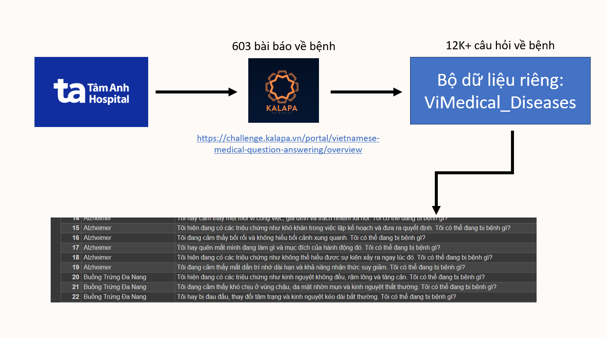

 <h1 > 🗃 ViMedical Disease</h1>
 
  

 Ngày tạo: 2024-04-05  Tác giả: Phuc Nguyen, Dao Thong

[**English cap: here**](https://github.com/PB3002/ViMedical_Disease/tree/main)

## Tổng quan:

ViMedical Disease là bộ dữ liệu bao gồm một tập hợp với hơn 12K+ các câu hỏi và triệu chứng cho một số bệnh thường gặp. Bộ dữ liệu này được thiết kế để hỗ trợ việc phân loại triệu chứng bệnh và xác định bệnh lý một cách sơ bộ. Nó chứa thông tin về nhiều loại bệnh phổ biến, bao gồm cả bệnh lý về tim mạch, đường tiêu hóa, thần kinh, da liễu, nội tiết, và nhiều bệnh lý khác. Bộ dữ liệu này có thể được sử dụng cho các mục đích nghiên cứu, phát triển mô hình dự đoán bệnh lý, hoặc cung cấp thông tin cho người dùng về các triệu chứng bệnh thường gặp.

Bộ dữ liệu hiện đã có trên các nền tảng khác như:

-   [**<u>Kaggle</u>**](https://www.kaggle.com/datasets/pb30025030/vimedical-disease/data)

-  [**<u>Huggingface</u>**](https://huggingface.co/datasets/PB3002/ViMedical_Disease)

## ⚠️Lưu ý:

- Bộ dữ liệu này chỉ cung cấp thông tin về triệu chứng bệnh, không phải là chẩn đoán y tế chính thức.

- Người dùng nên tham khảo ý kiến bác sĩ để được chẩn đoán và điều trị chính xác.

## Quá trình xây dựng bộ dữ liệu:

Bộ dữ liệu ViMedical_Diseases được dựa trên một bộ dữ liệu có sẵn từ trước lấy từ cuộc thi Kalapa Bytebattles 2023 tại mục Vietnamese Medical Question Answering.

Bộ dữ liệu cung cấp hơn 600 bài viết về các loại bệnh, được thu thập từ bệnh viện Tâm Anh

Từ bộ dữ liệu có sẵn, trích xuất ra được 603 loại bệnh khác nhau và tiến hành tạo 20 câu hỏi về người bệnh đang mắc triệu chứng của căn bệnh đó.

## Cấu trúc:

Mỗi câu hỏi sẽ có cấu trúc như sau: "Tôi đang có các triệu chứng như/Tôi đang cảm thấy/Tôi hay/..." + mô tả triệu chứng của bệnh từ bài viết + ". Tôi có thể đang bị bệnh gì?"

Mỗi câu hỏi sẽ bắt đầu bằng những cụm từ như "Tôi/Tôi đang có các triệu chứng như/Tôi đang cảm thấy/Tôi hay/...".

Theo sau những cụm từ trên sẽ là các triệu chứng về căn bệnh được lấy từ bài viết.

Và câu hỏi sẽ luôn được kết thúc với câu hỏi "Tôi có thể đang bị bệnh gì?".

Bộ dữ liệu có 2 cột:

- `Disease` : Tên bệnh

- `Question`:  Câu hỏi và mô tả triệu chứng của bệnh

##### Ví dụ về dữ liệu:

| Disease             | Question                                                                                    |
|:------------------- |:------------------------------------------------------------------------------------------- |
| Bệnh Cơ Tim Giãn Nở | Tôi đang cảm thấy mệt mỏi, chóng mặt và nhịp tim không đều. Tôi có thể đang bị bệnh gì?     |
| Alzheimer           | Tôi hay quên mất mình đang làm gì và mục đích của hành động đó. Tôi có thể đang bị bệnh gì? |
| Viêm Cầu Thận Lupus | Tôi đang cảm thấy suy giảm chức năng thận, hội chứng thận hư. Tôi có thể đang bị bệnh gì?   |

## Bộ dữ liệu có thể dùng để:

-    Phân tích dữ liệu 
-    Xây dựng mô hình dự đoán bệnh
-    Tạo chatbot
-    Hỗ trợ người dùng

## Muốn đóng góp cho bộ dữ liệu?

Chúng tôi luôn hoan nghênh mọi ý tưởng và đóng góp để hoàn thiện dự án. Nếu bạn có bất kỳ đề xuất cải tiến nào, hãy chia sẻ với chúng tôi bằng cách gửi thông tin chi tiết về những thay đổi bạn mong muốn qua email phucgot3110a1@gmail.com . Bạn cũng có thể trực tiếp đóng góp vào dự án bằng cách [tạo một Pull Request](https://github.com/PB3002/ViMedical_Disease/pulls). Mọi đóng góp đều được chúng tôi trân trọng và ghi nhận.

## 📢 Bản quyền:

Bản quyền © 2024 PB. Bảo lưu mọi quyền.

Bộ dữ liệu này được cấp phép theo giấy phép Attribution-NonCommercial-ShareAlike 4.0 International (CC BY-NC-SA 4.0).

**Bằng việc tải xuống bộ dữ liệu, người dùng đồng ý:**

- Chỉ sử dụng bộ dữ liệu cho mục đích phi thương mại, bao gồm nghiên cứu, giáo dục và sử dụng cá nhân.

- Ghi công bộ dữ liệu cho ViMedical bằng cách trích dẫn rõ ràng và nổi bật trong mọi trường hợp sử dụng.

- Không sửa đổi, điều chỉnh hoặc tạo tác phẩm phái sinh dựa trên bộ dữ liệu.

- Tuân thủ tất cả các luật và quy định hiện hành liên quan đến việc sử dụng dữ liệu cá nhân.

- Chịu hoàn toàn trách nhiệm cho bất kỳ hậu quả nào phát sinh từ việc sử dụng bộ dữ liệu.To be solely responsible for any consequences arising from the use of the dataset.
